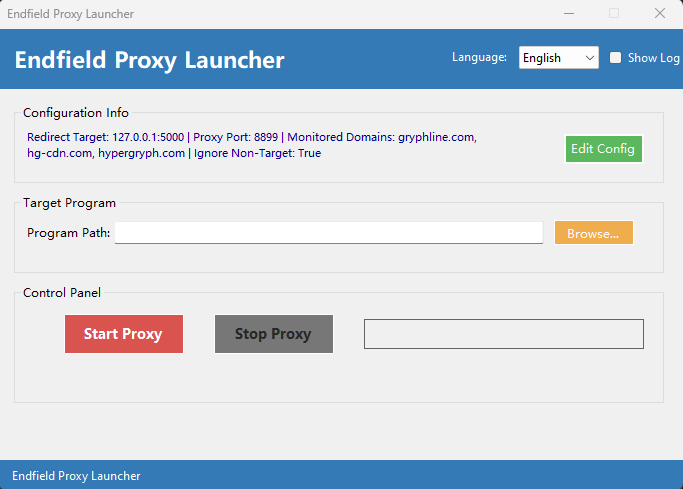

# Endfield Proxy Launcher

<div align=center></div>

这是一个为某款工厂建造类游戏设计的第三方网络代理工具。它允许用户启动一个本地代理服务器，拦截特定的游戏网络请求，并将其重定向到用户指定的本地服务器地址。本工具主要面向开发者、研究人员或需要进行本地测试的用户。

This is a third-party network proxy tool designed for a certain factory-building game. It allows users to start a local proxy server to intercept specific game network requests and redirect them to a user-specified local server address. This tool is primarily intended for developers, researchers, or users who need to perform local testing.

[English Version](#english-readme)

---

## 中文 README

### ✨ 功能特性

- **图形用户界面 (GUI)**: 提供简单易用的 Windows Forms 界面。
- **一键代理**: 轻松启动和停止代理服务。
- **自动配置**: 可将代理设置自动应用于启动的目标程序。
- **高度可配置**: 通过 `config.json` 文件，用户可以自定义代理端口、重定向目标地址和需要监控的域名。
- **实时日志**: 提供一个日志窗口，实时显示代理活动、请求拦截和重定向信息。
- **多语言支持**: 内置中文和英文界面，并支持扩展。

### 📋 使用前提

- Windows 操作系统
- .NET Desktop Runtime (推荐 .NET 8.0 或更高版本)

### 🚀 如何使用

1.  **下载程序**: 从 [Releases](https://github.com/RoyZ-iwnl/EndfieldProxyLauncher/releases) 页面下载最新版本的程序。
2.  **配置 `config.json`**:
    - 程序首次运行会自动在根目录生成一个 `config.json` 文件。
    - **`proxyPort`**: 本地代理服务监听的端口（默认为 `8899`）。
    - **`redirectHost`**: 您本地服务器的 IP 地址（默认为 `127.0.0.1`）。
    - **`redirectPort`**: 您本地服务器的端口（默认为 `5000`）。
    - **`targetDomains`**: 需要被代理和重定向的域名列表。
3.  **运行程序**:
    - 直接运行 `ProxyLauncher.exe`。如果未获得管理员权限，程序会自动尝试提权。
    - 在 "目标程序" -> "程序路径" 处，点击 "浏览..." 选择游戏的主程序 `.exe` 文件。
    - 点击 "启动代理" 按钮。
    - 此时代理服务已启动，并且目标游戏也会随之启动。所有来自游戏的、域名匹配 `targetDomains` 的网络请求都将被重定向。
4.  **停止服务**: 点击 "停止代理" 按钮，程序将关闭代理服务并尝试终止游戏进程。

### 🌐 如何添加新语言

本程序通过 `Languages` 目录下的 `.json` 文件实现多语言支持。添加一门新语言需要修改少量源代码，步骤如下：

1.  **创建语言文件**:
    - 在程序根目录下的 `Languages` 文件夹中，复制一份 `en-US.json` 或 `zh-CN.json`。
    - 将其重命名为目标语言的 [ISO 语言代码](https://www.gnu.org/software/gettext/manual/html_node/Language-Codes.html)，例如 `ja-JP.json` (日语)。
    - 使用文本编辑器打开新的 `.json` 文件，将所有 `value`（冒号右侧的文本）翻译成您的目标语言。**请确保不要修改 `key`（冒- 号左侧的键名）**。

2.  **修改源代码并重新编译**:
    - **文件**: `LanguageManager.cs`
    - **函数**: `GetAvailableLanguages()`
    - **操作**: 将你的新语言代码添加到返回的数组中。
      ```
      // 修改前
      public static string[] GetAvailableLanguages() => new[] { "zh-CN", "en-US" };

      // 修改后 (以日语为例)
      public static string[] GetAvailableLanguages() => new[] { "zh-CN", "en-US", "ja-JP" };
      ```
    - **文件**: `MainForm.cs`
    - **函数**: `CreateTopPanel()`
    - **操作**: 在语言选择下拉框中添加新语言的显示名称。
      ```
      // 修改前
      cmbLanguage.Items.AddRange(new[] { "中文", "English" });

      // 修改后 (以日语为例)
      cmbLanguage.Items.AddRange(new[] { "中文", "English", "日本語" });
      ```
    - **文件**: `MainForm.cs`
    - **函数**: `CmbLanguage_SelectedIndexChanged()`
    - **操作**: 修改下拉框索引与语言代码的映射关系。
      ```
      // 修改前
      // string langCode = cmbLanguage.SelectedIndex == 0 ? "zh-CN" : "en-US";
      
      // 修改后 (推荐使用 switch 结构)
      string langCode;
      switch (cmbLanguage.SelectedIndex)
      {
          case 0:
              langCode = "zh-CN";
              break;
          case 1:
              langCode = "en-US";
              break;
          case 2:
              langCode = "ja-JP"; // 新增
              break;
          default:
              langCode = "en-US"; // 默认
              break;
      }
      LanguageManager.LoadLanguage(langCode);
      UpdateLanguageTexts();
      UpdateConfigDisplay();
      ```

3.  **重新编译**: 完成代码修改后，使用 Visual Studio 重新编译项目即可。

### ⚠️ 免责声明

本工具为第三方开发，仅供学习和研究使用，与目标游戏的开发商或发行商无关。请在遵守相关法律法规和用户协议的前提下使用本工具。因使用本工具导致的任何后果，由使用者自行承担。

---

## English README

### ✨ Features

-   **Graphical User Interface (GUI)**: Provides a simple and easy-to-use Windows Forms interface.
-   **One-Click Proxy**: Easily start and stop the proxy service.
-   **Auto-Configuration**: Automatically applies proxy settings to the launched target application.
-   **Highly Configurable**: Users can customize the proxy port, redirection target, and monitored domains via a `config.json` file.
-   **Real-time Logging**: A log window displays real-time proxy activity, request interceptions, and redirection information.
-   **Multi-language Support**: Built-in support for Chinese and English, with the ability to add more languages.

### 📋 Prerequisites

-   Windows OS
-   .NET Desktop Runtime (.NET 6.0 or newer recommended)

### 🚀 Getting Started

1.  **Download**: Get the latest version from the [Releases](https://github.com/RoyZ-iwnl/EndfieldProxyLauncher/releases) page.
2.  **Configure `config.json`**:
    -   The program will generate a `config.json` file in its root directory on the first run.
    -   **`proxyPort`**: The port for the local proxy service to listen on (default: `8899`).
    -   **`redirectHost`**: The IP address of your local server (default: `127.0.0.1`).
    -   **`redirectPort`**: The port of your local server (default: `5000`).
    -   **`targetDomains`**: A list of domains to be proxied and redirected.
3.  **Run the application**:
    -   Run `ProxyLauncher.exe`. It will automatically request administrator privileges if needed.
    -   In the "Target Program" -> "Program Path" section, click "Browse..." to select the game's main `.exe` file.
    -   Click the "Start Proxy" button.
    -   The proxy service will start, and the target game will be launched. All network requests from the game matching the `targetDomains` will be redirected.
4.  **Stop the service**: Click the "Stop Proxy" button to shut down the proxy service and attempt to terminate the game process.

### 🌐 How to Add a New Language

This application uses `.json` files in the `Languages` directory for multi-language support. Adding a new language requires minor source code modifications. Follow these steps:

1.  **Create the Language File**:
    -   In the `Languages` folder within the program's root directory, make a copy of `en-US.json` or `zh-CN.json`.
    -   Rename it to the [ISO language code](https://www.gnu.org/software/gettext/manual/html_node/Language-Codes.html) of your target language, e.g., `ja-JP.json` for Japanese.
    -   Open the new `.json` file with a text editor and translate all the `value`s (text to the right of the colon). **Do not modify the `key`s (text to the left of the colon)**.

2.  **Modify Source Code and Recompile**:
    -   **File**: `LanguageManager.cs`
    -   **Function**: `GetAvailableLanguages()`
    -   **Action**: Add your new language code to the returned array.
        ```
        // Before
        public static string[] GetAvailableLanguages() => new[] { "zh-CN", "en-US" };

        // After (example for Japanese)
        public static string[] GetAvailableLanguages() => new[] { "zh-CN", "en-US", "ja-JP" };
        ```
    -   **File**: `MainForm.cs`
    -   **Function**: `CreateTopPanel()`
    -   **Action**: Add the display name for the new language to the language selection ComboBox.
        ```
        // Before
        cmbLanguage.Items.AddRange(new[] { "中文", "English" });

        // After (example for Japanese)
        cmbLanguage.Items.AddRange(new[] { "中文", "English", "日本語" });
        ```
    -   **File**: `MainForm.cs`
    -   **Function**: `CmbLanguage_SelectedIndexChanged()`
    -   **Action**: Update the mapping between the ComboBox index and the language code.
        ```
        // Before
        // string langCode = cmbLanguage.SelectedIndex == 0 ? "zh-CN" : "en-US";
        
        // After (using a switch statement is recommended)
        string langCode;
        switch (cmbLanguage.SelectedIndex)
        {
            case 0:
                langCode = "zh-CN";
                break;
            case 1:
                langCode = "en-US";
                break;
            case 2:
                langCode = "ja-JP"; // Added
                break;
            default:
                langCode = "en-US"; // Fallback
                break;
        }
        LanguageManager.LoadLanguage(langCode);
        UpdateLanguageTexts();
        UpdateConfigDisplay();
        ```

3.  **Recompile**: After making the code changes, recompile the project using Visual Studio.

### ⚠️ Disclaimer

This is a third-party tool developed for educational and research purposes only. It is not affiliated with the developers or publishers of the target game. Please use this tool in compliance with all relevant laws, regulations, and user agreements. The user assumes all responsibility for any consequences arising from the use of this tool.
